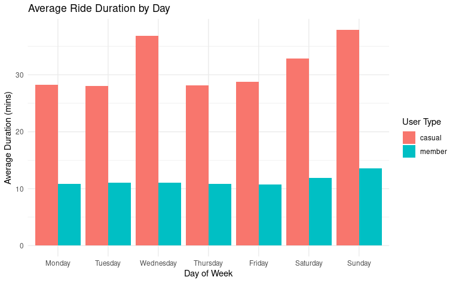
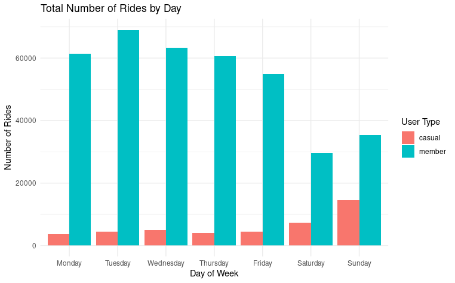

# 🚲 Cyclistic Capstone Project (Mini Case Study)

This project analyzes public bike-sharing data to uncover differences in user behavior between casual riders and annual members. It focuses on Q1 2019 and Q1 2020, using R for cleaning, analysis, and visualization.

---

## 🧠 Key Business Goal:
Help Cyclistic convert more **casual riders into annual members** by understanding ride trends.

---

## 🔧 Tools Used:
- R
- tidyverse (dplyr, ggplot2)
- Posit Cloud (RStudio)

---

## 📊 Visuals

### 1. Average Ride Duration by Day of Week

### 2. Total Number of Rides by Day of Week

---

## 📈 Insights:
- Casual riders take longer rides — especially on weekends (up to ~38 minutes).
- Members ride consistently during weekdays, with shorter trips (~11 minutes).
- Suggests casuals are leisure users, while members are commuters.

---

## 📦 Dataset:
The original data was provided by the Google Data Analytics Capstone through Coursera and has been filtered to two quarters due to memory limitations in Posit Cloud.
